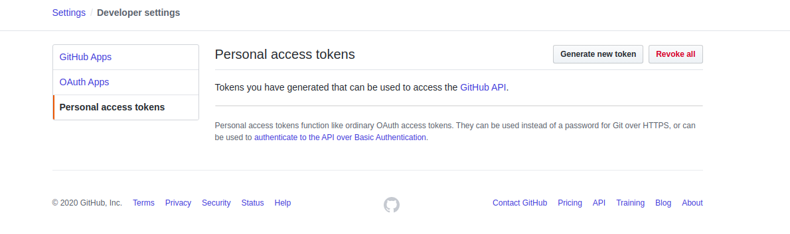

## Github Token Generation

### Login to your github repository

### Go to [this](https://github.com/settings/tokens) url. you will see a page like following.



### ``` Click ``` ```Generate new token```

### User may provide a note. Check ```Repo``` option like following,


### ``` Click ``` ```Generate Token ``` button placed in the bottom.

### User will be derived to the previous page. This time user will see access token list like following,


### User can copy this ```Access token``` and use this to integrate with [klovercloud]()