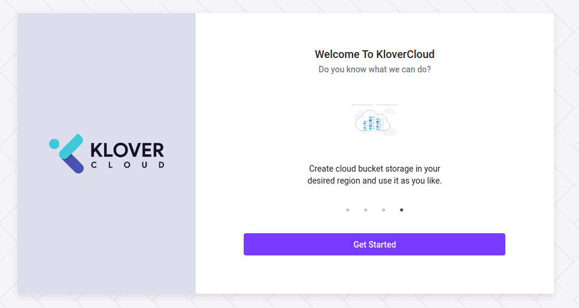
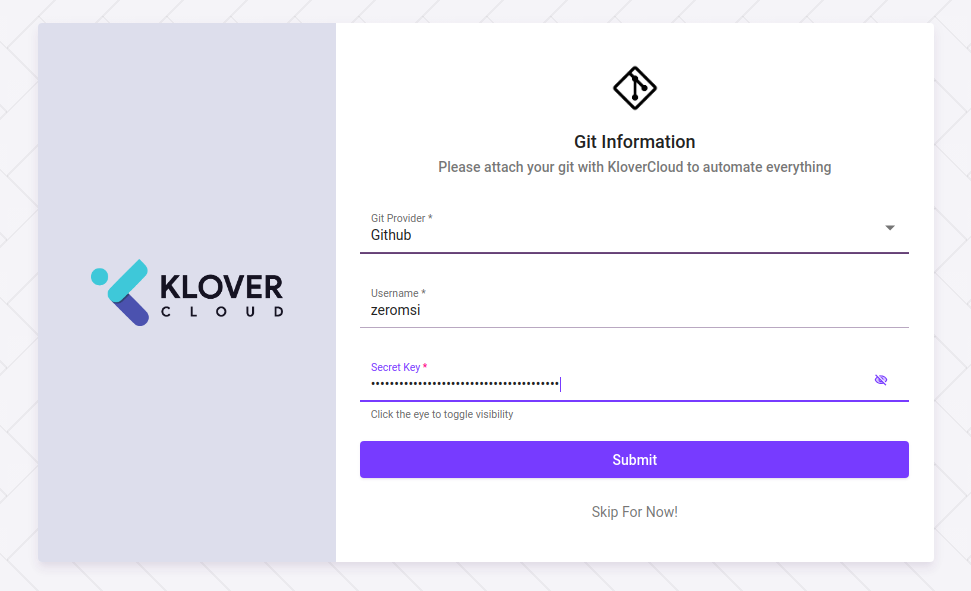
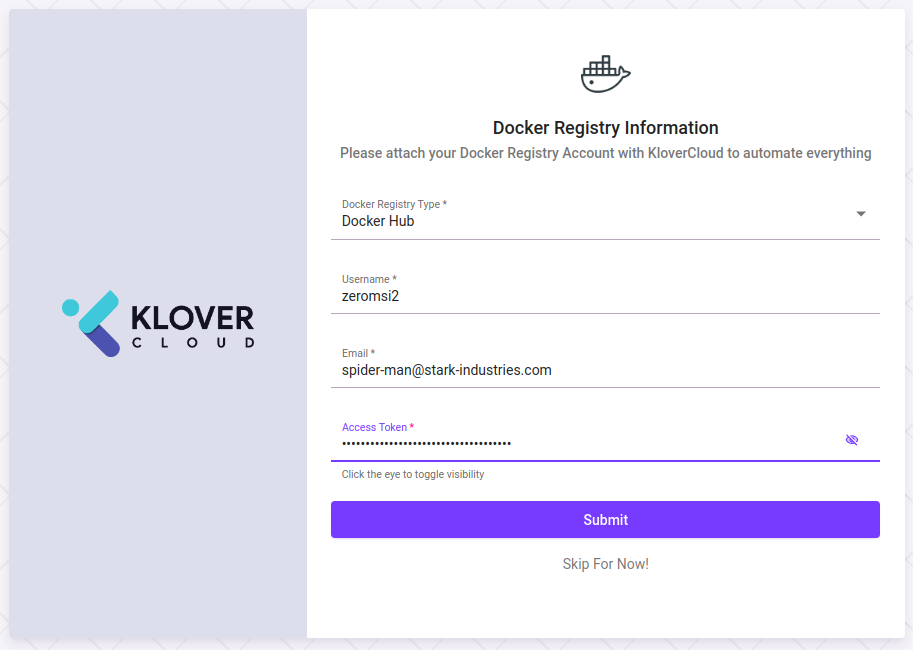
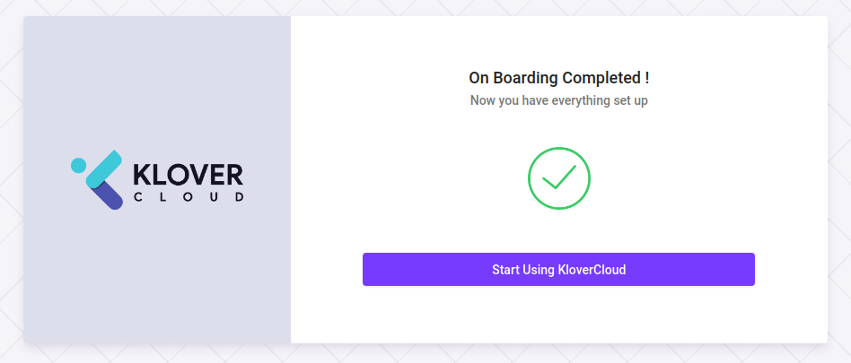
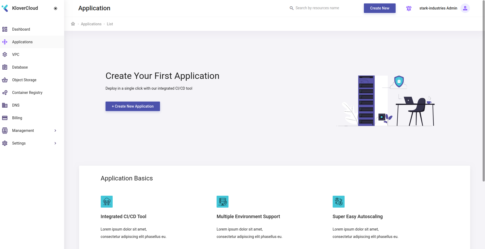

# Prerequisities


## Registration

In order to incorporate offered services, user must be registerted to klovecloud. Some of the services require certain repository and registry authority.

### Let's follow the following steps to get registered

#### Browse to user registration [url](https://webapp.klovercloud.io/auth/login)


Currently, user can sign up with ``` google ```, ```Github```, ``` BitBucket``` or ``` GitLab``` account. Alongside with these options, user can also sign up by providing due informations and credentials after ```clicking``` [sign up for free](https://webapp.klovercloud.io/auth/register) option.


``` Note:```If user wants to use klovercloud CI/CD, user must provide token of due ```repository``` and ```registry```.

After registration, while login to the system for the very first time, a popup will appear and ask for tokens. Let's see how to perform ```repository``` and ```registry``` registration.

### Browse to sign in [url](https://webapp.klovercloud.io/auth/login),provide credential and click ```SIGN IN``` button.


### A popup will appear, ```click``` ```Get Started```



### A popup will appear, user needs to ``` select``` from git repository options, provide git ```username``` and ```token``` and click ```Submit``` button. [See how to create a token](./GitTokenGeneration.md)



### Another popup will appear, user needs to ```select``` from registry options, provide registry ```username```, ```email```, ```token``` and click ```Submit``` button. [See how to create a token](./RegistryTokenGeneration.md)




### User will be derived to the following page. It says that, basic integrations are completed and user can start using [Klovercloud]().



### ```Click``` ```Start Using Klovercloud```, it will derive user the follwoing page,




