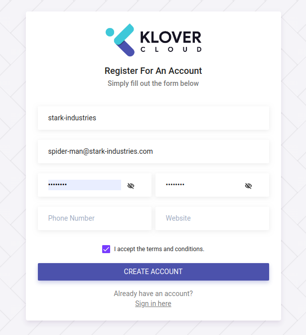

# Prerequisities


## Registration

In order to incorporate offered services, user must be registerted to klovecloud. Some of the services require certain repository and registry authority.

### Let's follow the following steps to get registered

#### Browse to user registration [url](https://webapp.klovercloud.io/auth/login)


Currently, user can sign up with ``` google ```, ```Github```, ``` BitBucket``` or ``` GitLab``` account. Alongside with these options, user can also sign up by providing due informations and credentials after ```clicking``` [sign up for free](https://webapp.klovercloud.io/auth/register) option.




## Sign in

Provide cedential and get signed in.

