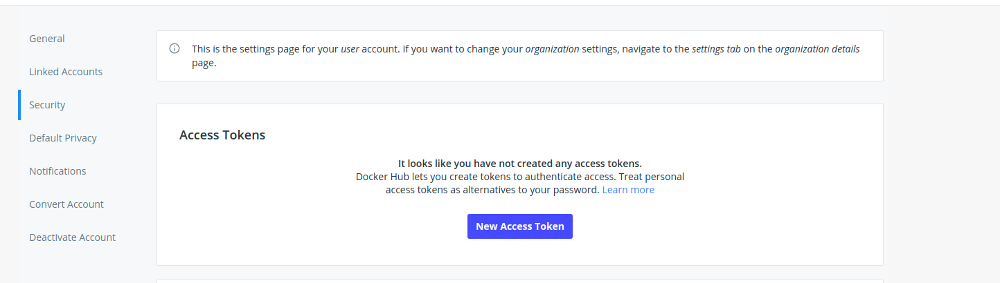
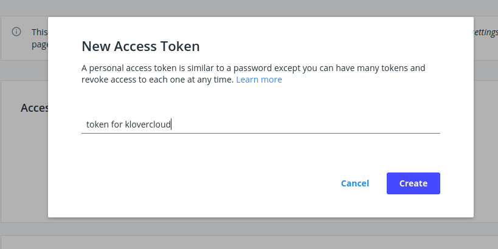
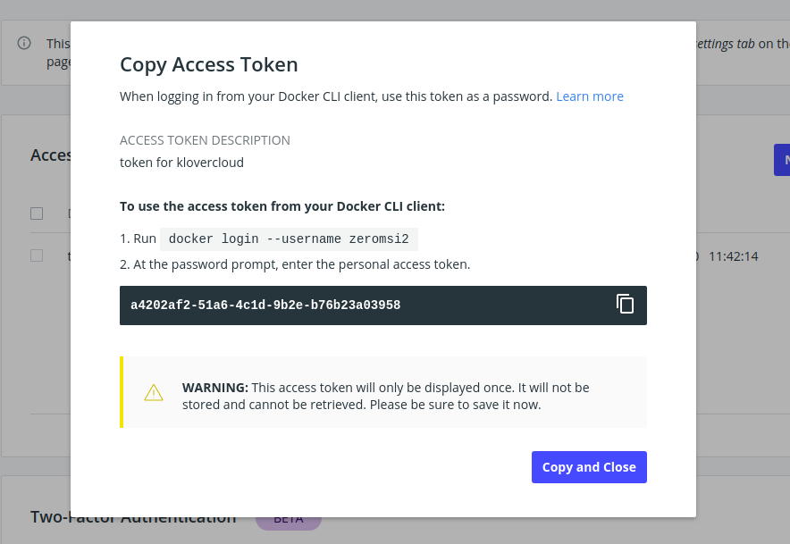

# Registry Token Generation

## Docker Token Generation

### Login to [dockerhub](https://hub.docker.com/)

### Go to [this](https://hub.docker.com/settings/security) url. you will see a page like following.


### ```Click```  ```New Access Token``` button.

### A new popup will appear. Provide ```key``` against which ```token``` will be generated. 



### ```Click```  ``` create``` button. A popub will appear like following, copy the token and use it to integrate you registry with [Klovercloud]() 


