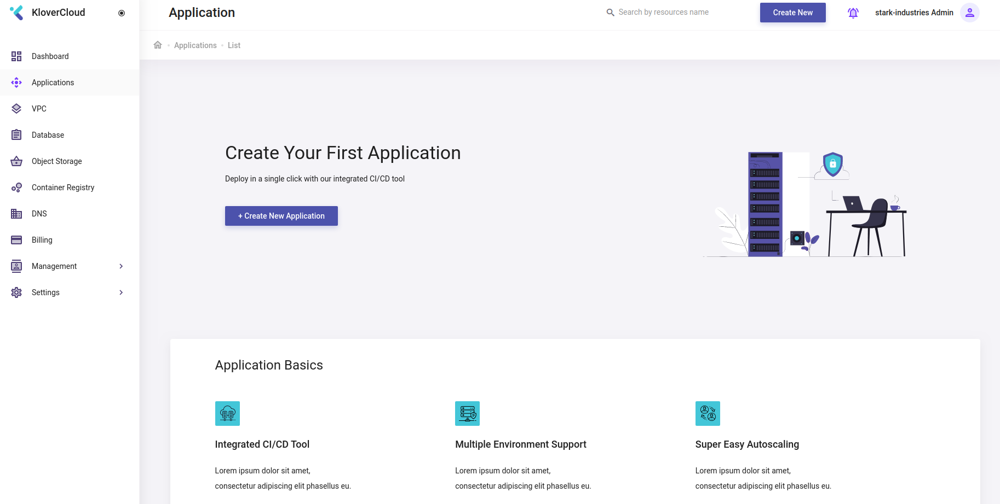
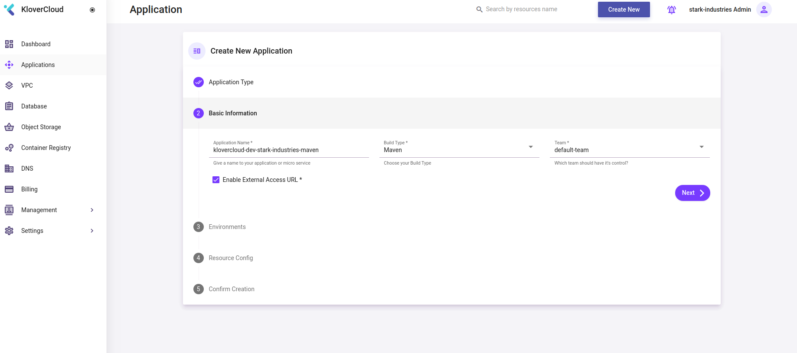
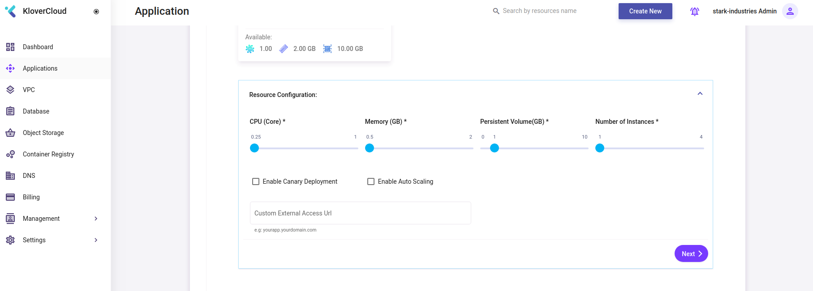

### To create application, user will ```click``` ```Applications``` menu or ```browse``` to [this](https://webapp.klovercloud.io/applications) url. The page is similiar to the following image,



### ```Click``` ```Create Application``` button to ```create``` new app or ```on board``` existing one. An window will appear like following,


### ```Click``` ```Create New App``` option. It will derive user to new application creation window.


### ```Click``` ```Spring boot``` option and provide ```application name```, select ```build type``` and ```team``` like following, and then ```click``` ```Next``` button.




### Now ```Select``` expected ```environments from available options as follow, and then ```click``` ```Next``` button.


### Users will see options to allocate resource to their selected environments.


### To allocate resource, users need to ```click``` ```Select a VPC For {{environment name}} Environment``` button. A popup will appear like following, where a list of available ```PVC``` will be shown.


### ```Select``` a ```VPC`` from the available options. ```Click``` ```Confirm``` button.


### User will see options to allocate ```CPU```, ```RAM```,```Persistent Volume``` and ```Number of instances```. Beside this options to enable ```canary deployment``` and ```auto scalling``` and a option to enter custom ```access url`` will be there. All these options are according to the selected ```PVC```'s configurations.



### Allocate resource and enable options according to users need like following, then ```click``` ```Next``` button.


### In the same way, allocate resource for other evnvironments.


### At last a Summary will be shown like following, ```Click``` ```Create Application``` button to complete application creation process.


