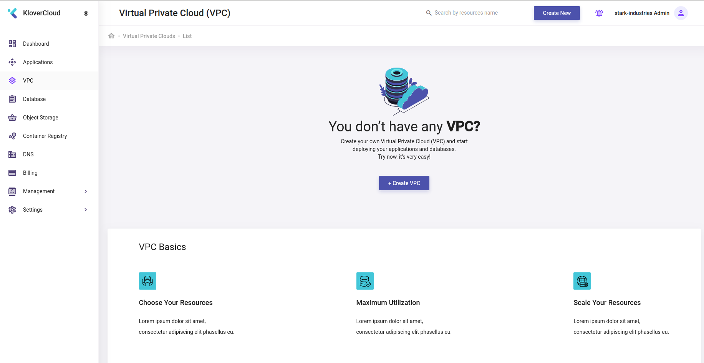
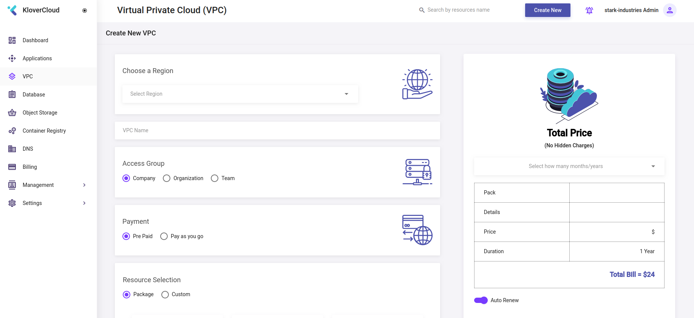
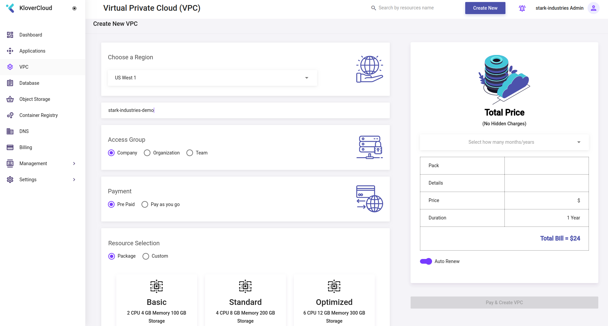
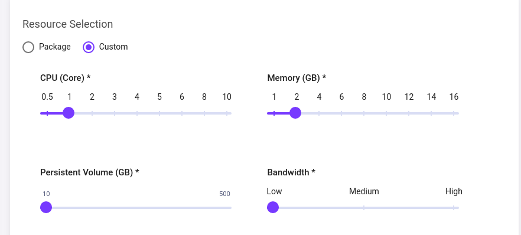
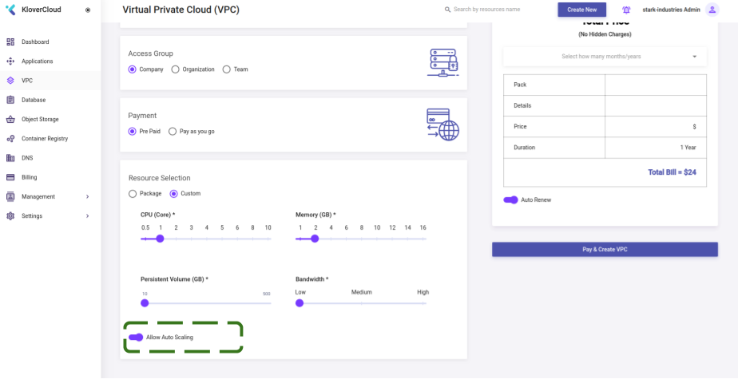

# Create VPC

## ```Click``` ```VPC``` option from menu or browse to [this](https://webapp.klovercloud.io/vpc) url. User will see a page like following,



## Click ```Create VPC``` Button. It will derive user to the following page,



Select ```region```, check ```Access Group```, ```Payment``` and ```Resource Selection``` like following,


Incase if user wants to use resources as demand, ```Custom``` option needs to be selected as following,



If User wants auto scalling feature, it must be enabled as by default it is desdabled.



Last of all ```Click``` ```Pay & Create VPC``` button to complete ```VPC``` creation.

